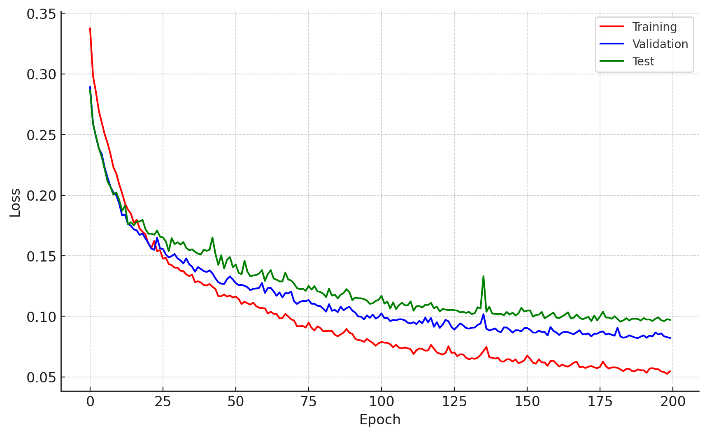

# GNN-land-use

## Update on 2024-03-02
- **Name**: Xuehao
- **Date of Update**: 2024-03-02

## Summary

- **Mini-batch Training Process**: Implemented a mini-batch method for graph data.

- **Multiple Sampling Methods**: The update provides options for different sampling processes, allowing the selection between 'RandomNodes' and 'NeighborNodes'. 

- **Isolation of Test Data**: To prevent data leakag. the test data has been isolated from the training dataset, following the suggestion from Adam.

## Performance

 - GraghSage (with Neighbor-sampling) 
 - Batch size of 64 and epoch of 200.

|            | MSE   | RMSE  | MAE   | R2    |
|------------|-------|-------|-------|-------|
| office     | 0.078 | 0.278 | 0.175 | 0.714 |
| leisure    | 0.053 | 0.231 | 0.167 | 0.620 |
| transport  | 0.067 | 0.259 | 0.176 | 0.788 |
| retail     | 0.107 | 0.327 | 0.230 | 0.725 |
| sustenance | 0.113 | 0.336 | 0.209 | 0.842 |
| residence  | 0.086 | 0.293 | 0.168 | 0.390 |

